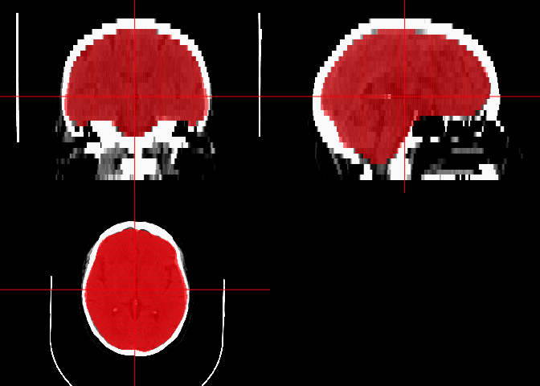

<!-- README.md is generated from README.Rmd. Please edit that file -->

# brainchop

<!-- badges: start -->

[](https://github.com/muschellij2/brainchop/actions/workflows/R-CMD-check.yaml)
<!-- badges: end -->

The goal of `brainchop` package is to wrap the `brainchop` command line
interface (<https://github.com/neuroneural/brainchop-cli>) to perform
Skull Stripping/Mind Grabbing.

## Installation

You can install the development version of `brainchop` like so:

``` r
pak::pak("muschellij2/brainchop")
```

## Example

Here is how you can segment a CT scan:

``` r
Sys.setenv("RETICULATE_PYTHON" = "managed")
library(brainchop)
library(curl)
#> Warning: package 'curl' was built under R version 4.4.1
#> Using libcurl 8.7.1 with LibreSSL/3.3.6
library(neurobase)
#> Loading required package: oro.nifti
#> oro.nifti 0.11.4
input = tempfile(fileext = ".nii.gz")
if (!file.exists(input)) {
  curl::curl_download(
  "https://github.com/aqqush/CT_BET/raw/refs/heads/master/image_data/ct_20130524_1011_101232_j40s2.nii.gz",
  destfile = input)
}
bc_list_models()
#> Available models:
#> - tissue_fast: ⚡ our fastest tissue segmentation model that produces gray and white matter labels
#> - subcortical: 🪓 a robust model that can handle clinical scans and other difficult input volumes producing cortical tissue segmentation accompanied by 15 subcortical regions
#> - DKatlas: 🔪 segments the brain into the Desikan-Killiany Atlas with 104 labels
#> - multiaxial: 🧠 multi-axial 3D brain segmentation using sagittal, axial, and coronal views with a consensus layer
#> - mindgrab: tissue extraction
#> $tissue_fast
#> $tissue_fast$folder
#> [1] "model5_gw_ae"
#> 
#> $tissue_fast$description
#> [1] "⚡ our fastest tissue segmentation model that produces gray and white matter labels"
#> 
#> $tissue_fast$considerations
#> [1] "min/max normalization"
#> 
#> $tissue_fast$parameter_name
#> [1] "tissue_fast"
#> 
#> 
#> $subcortical
#> $subcortical$folder
#> [1] "model30chan18cls"
#> 
#> $subcortical$description
#> [1] "🪓 a robust model that can handle clinical scans and other difficult input volumes producing cortical tissue segmentation accompanied by 15 subcortical regions"
#> 
#> $subcortical$considerations
#> [1] "min/max normalization"
#> 
#> $subcortical$parameter_name
#> [1] "subcortical"
#> 
#> 
#> $DKatlas
#> $DKatlas$folder
#> [1] "model21_104class"
#> 
#> $DKatlas$description
#> [1] "🔪 segments the brain into the Desikan-Killiany Atlas with 104 labels"
#> 
#> $DKatlas$considerations
#> [1] "min/max normalization"
#> 
#> $DKatlas$parameter_name
#> [1] "DKatlas"
#> 
#> 
#> $multiaxial
#> $multiaxial$folder
#> [1] "multiaxial"
#> 
#> $multiaxial$description
#> [1] "🧠 multi-axial 3D brain segmentation using sagittal, axial, and coronal views with a consensus layer"
#> 
#> $multiaxial$considerations
#> [1] "uses ONNX models"
#> 
#> $multiaxial$parameter_name
#> [1] "multiaxial"
#> 
#> $multiaxial$model_type
#> [1] "multiaxial"
#> 
#> 
#> $mindgrab
#> $mindgrab$folder
#> [1] "mindgrab"
#> 
#> $mindgrab$description
#> [1] "tissue extraction"
#> 
#> $mindgrab$considerations
#> [1] "quantile normalization"
#> 
#> $mindgrab$parameter_name
#> [1] "mindgrab"
```

``` r
result = ct_mindgrab(input, device = "CPU")
#> loaded weights in  42.35 ms, 0.00 GB loaded at 0.01 GB/s
img = window_img(input)
# brain = window_img(result$output)
mask = window_img(result$mask)
ortho2(img, mask, col.y = "#FF000080", NA.y = TRUE)
```


